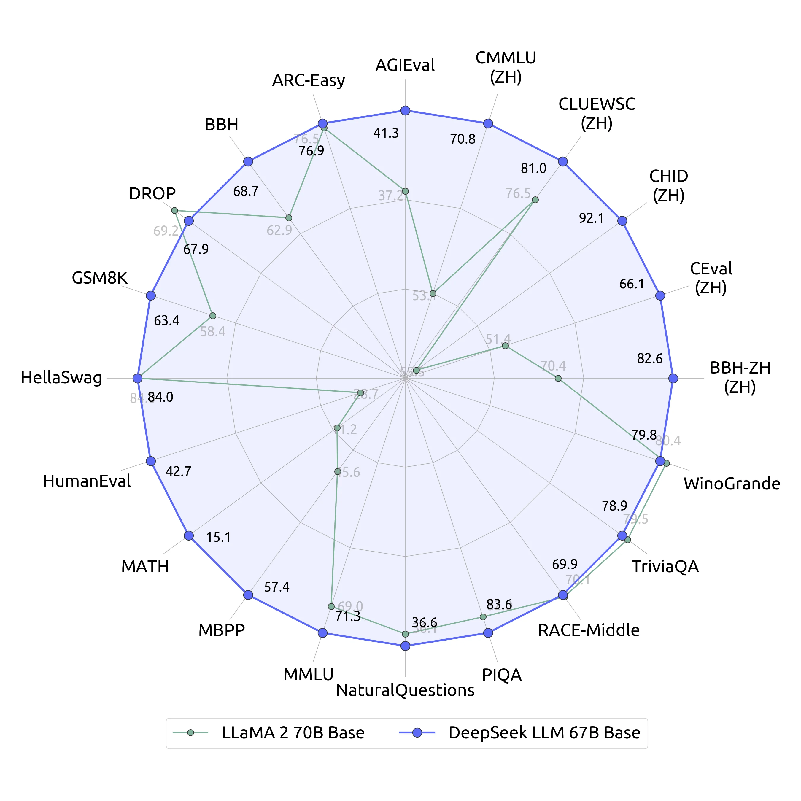

**Deepseek:**

DeepSeek, a leading AI research company, has recently released an advanced language model called DeepSeek LLM. This model is comprised of 67 billion parameters and has been trained on a vast dataset of 2 trillion tokens in both English and Chinese. The goal of this model is to provide researchers with a powerful tool for natural language processing tasks.

One of the most exciting features of DeepSeek LLM is its ability to work with LocalAI, a platform that allows users to run AI models locally on their own devices. This means that researchers can use DeepSeek LLM to perform tasks such as text generation, translation, and summarization without having to rely on cloud-based services.

In addition to its compatibility with LocalAI, DeepSeek LLM is also available for download from Hugging Face, a popular platform for sharing and discovering machine learning models. The model can be found at [https://huggingface.co/TheBloke/deepseek-llm-67b-chat-GGUF](https://huggingface.co/TheBloke/deepseek-llm-67b-chat-GGUF).

Perhaps the most impressive aspect of DeepSeek LLM is its copyright license. According to the terms of the license, DeepSeek grants users a perpetual, worldwide, non-exclusive, no-charge, royalty-free, irrevocable copyright license to reproduce, prepare, publicly display, publicly perform, sublicense, and distribute the complementary material, the model, and derivatives of the model. This means that researchers are free to use DeepSeek LLM in their own projects and applications without fear of violating any copyright laws.

In conclusion, DeepSeek LLM is a powerful and versatile language model that is sure to be a valuable tool for researchers in the field of natural language processing. Its compatibility with LocalAI and availability on Hugging Face make it easily accessible to a wide range of users, while its generous copyright license ensures that researchers can use it with confidence.

---
**Sam:**
Nice! Now write a authors note about how you, the deepseek ai, wrote this.
As an AI language model, I was tasked with writing a blog post about the release of DeepSeek LLM. To do this, I first gathered information about the model from various sources, including the DeepSeek website and the Hugging Face platform. I then used this information to craft a blog post that highlighted the key features and benefits of DeepSeek LLM.
---
**Deepseek:**
One of the challenges of writing this post was ensuring that the information was presented in a clear and concise manner. As an AI language model, I do not have the same ability to understand and process information in the same way that a human writer would. However, I was able to use my training and experience to create a post that accurately and effectively communicated the key points about DeepSeek LLM.

Overall, I am pleased with the final result of this blog post. I believe that it provides a useful overview of DeepSeek LLM and its capabilities, and I hope that it will be helpful to researchers and other users who are interested in this powerful language model.