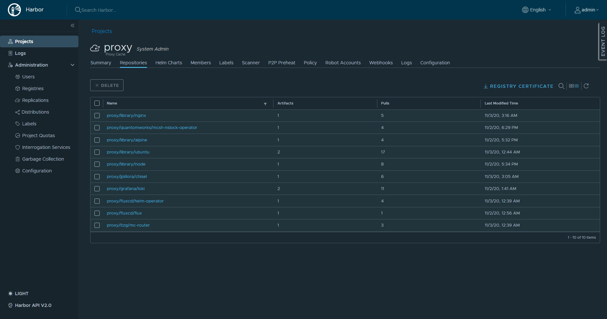

It's fun. Though it only works for CRI-O right now since the mirror requires a `/project` rather than just a base URL. I mean, you could maybe get fancy with some sort of urirewrite but I'm not getting into that today.

## TLDR
Anyway, works like this:
1. Install [CRI-O](https://cri-o.io/)
2. Set `/etc/containers/registries.conf` to a dummy mirror (for now, I did it the hard way with an existing harbor install but you can do it like this and save yourself a `kubectl drain node` + install)
3. `helm install harbor`
4. Create a project proxy with your creds.

A bit of a walkthrough.

## CRIO 
[https://cri-o.io/](https://cri-o.io/) gives you a good set of walkthroughs already. Though if you're building it for some RASPIs then you'll want to build it.

If you're running Ubuntu 20, their documentation for [building from source](https://github.com/cri-o/cri-o/blob/master/install.md#build-and-install-cri-o-from-source) needs a bit of an update. Do this for your build tools instead:
```
apt-get update -qq && apt-get install -y \
  btrfs-progs \
  git \
  golang-go \
  libassuan-dev \
  libdevmapper-dev \
  libglib2.0-dev \
  libc6-dev \
  libgpgme11-dev \
  libgpg-error-dev \
  libseccomp-dev \
  libsystemd-dev \
  libselinux1-dev \
  pkg-config \
  go-md2man \
  libudev-dev \
  software-properties-common \
  gcc \
  make
```
git pull + checkout release-1.19 + make + make install + make install config and you're good.

Follow the rest as stated. `journalctl -xeu crio` if your friend if you get lost. 

After that....

## Harbor

[https://github.com/goharbor/harbor-helm](https://github.com/goharbor/harbor-helm)
Install harbor using their chart. Their installation files are there, though **remember to change the image tags to v2.1.1 or the latest version instead of dev** unless you like pulling your hair out on bad defaults and oversight. 

```yml
core:
  image:
    repository: goharbor/harbor-core
    tag: v2.1.1

portal:
  image:
    repository: goharbor/harbor-portal
    tag: v2.1.1
# etc
```

Finally make a project in harbor that uses a registry. Instructions on their site [here](https://goharbor.io/docs/2.1.0/administration/configure-proxy-cache/). 
They give example such as ` docker pull <harbor_server_name>/<proxy_project_name>/goharbor/harbor-core:dev` if you were to use the proxy that way. Though we want this for all nodes. So back to crio.

## Telling the nodes
Take a look at the `registries.conf` documentation [on github](https://github.com/containers/image/blob/master/docs/containers-registries.conf.5.md).
Under the *Remapping and mirroring registries* section you can specify a mirror. Great for harbor since this we can just say "anything that doesn't have a domain attached to the image ref use this default endpoint and this mirror instead". Great for this scenario.

So in `/etc/containers/registries.conf`:
```
# use docker.io by default for images without a domain attached
unqualified-search-registries = ["docker.io"]
# for the said docker.io domain:
[[registry]]
prefix = "docker.io"
insecure = false
blocked = false
location = "docker.io"
#Use this nice mirror we made
[[registry.mirror]]
location = "harbor.internal/proxy"
```
I should mention I am using metallb and kube-router here. Configure your DNS server attached to your nodes to use the IP/domain of your harbor endpoint.
```
kubectl get services -n harbor
NAME                          TYPE           CLUSTER-IP       EXTERNAL-IP    PORT(S)                                     AGE
harbor                        LoadBalancer   10.109.119.72    192.168.0.11   80:30314/TCP,443:32758/TCP,4443:32086/TCP   2d2h
```
set `insecure = true` if you don't feel like distributing the CA to your nodes or exposing it to the public. 

And that's about it. Uhh. To test:

## Testing
Tail the harbor registry log really quick:

`kubectl logs -f -n harbor deployment/harbor-harbor-registry -c registry`

In another window,  run `kubectl run hello-world --image=hello-world`

1. Note the pod starting (ignore it crashing because it doesn't have a primary process that it keeps active (or use nginx like I did first but don't want to again to show proof of concept since I already pulled it))
2. Note the harbor logs:
```
time="2020-11-03T09:56:57.337908085Z" level=info msg="authorized request" go.version=go1.14.7 http.request.host="127.0.0.1:8080" http.request.id=48a82b34-e213-4b32-a300-3eee52cb8209 http.request.method=POST http.request.remoteaddr=127.0.0.1 http.request.uri="/v2/proxy/library/hello-world/blobs/uploads/" http.request.useragent=harbor-registry-client vars.name="proxy/library/hello-world"
10.244.5.155 - - [03/Nov/2020:09:56:57 +0000] "POST /v2/proxy/library/hello-world/blobs/uploads/ HTTP/1.1" 202 0 "" "harbor-registry-client"
time="2020-11-03T09:56:57.384957598Z" level=info msg="response completed" go.version=go1.14.7 http.request.host="127.0.0.1:8080" http.request.id=48a82b34-e213-4b32-a300-3eee52cb8209 http.request.method=POST http.request.remoteaddr=127.0.0.1 http.request.uri="/v2/proxy/library/hello-world/blobs/uploads/" http.request.useragent=harbor-registry-client http.response.duration=133.406756ms http.response.status=202 http.response.written=0
time="2020-11-03T09:56:57.488063294Z" level=info msg="authorized request" go.version=go1.14.7 http.request.host="127.0.0.1:8080" http.request.id=a6dbf8af-714b-4b0f-815a-de6d2992e2b3 http.request.method=PUT http.request.remoteaddr=127.0.0.1 http.request.uri="/v2/proxy/library/hello-world/blobs/uploads/db816973-b83c-440b-ad89-265fa1a0da60?_state=9omMhi_PjyQ3pT_90NDDH3aJ1dIyAsZ4PpOOuSET_8J7Ik5hbWUiOiJwcm94eS9saWJyYXJ5L2hlbGxvLXdvcmxkIiwiVVVJRCI6ImRiODE2OTczLWI4M2MtNDQwYi1hZDg5LTI2NWZhMWEwZGE2MCIsIk9mZnNldCI6MCwiU3RhcnRlZEF0IjoiMjAyMC0xMS0wM1QwOTo1Njo1Ny4zMzgwNDQzMDNaIn0%3D&digest=sha256%3Abf756fb1ae65adf866bd8c456593cd24beb6a0a061dedf42b26a993176745f6b" http.request.useragent=harbor-registry-client vars.name="proxy/library/hello-world" vars.uuid=db816973-b83c-440b-ad89-265fa1a0da60
time="2020-11-03T09:56:57.611819083Z" level=info msg="authorized request" go.version=go1.14.7 http.request.host="127.0.0.1:8080" http.request.id=b3565ead-f3d7-49c7-97b0-98fac56a2a5a http.request.method=POST http.request.remoteaddr=127.0.0.1 http.request.uri="/v2/proxy/library/hello-world/blobs/uploads/" http.request.useragent=harbor-registry-client vars.name="proxy/library/hello-world"
10.244.5.155 - - [03/Nov/2020:09:56:57 +0000] "GET / HTTP/1.1" 200 0 "" "Go-http-client/1.1"
10.244.5.155 - - [03/Nov/2020:09:56:57 +0000] "POST /v2/proxy/library/hello-world/blobs/uploads/ HTTP/1.1" 202 0 "" "harbor-registry-client"
time="2020-11-03T09:56:57.661360662Z" level=info msg="response completed" go.version=go1.14.7 http.request.host="127.0.0.1:8080" http.request.id=b3565ead-f3d7-49c7-97b0-98fac56a2a5a http.request.method=POST http.request.remoteaddr=127.0.0.1 http.request.uri="/v2/proxy/library/hello-world/blobs/uploads/" http.request.useragent=harbor-registry-client http.response.duration=135.212839ms http.response.status=202 http.response.written=0
time="2020-11-03T09:56:57.777840137Z" level=info msg="authorized request" go.version=go1.14.7 http.request.host="127.0.0.1:8080" http.request.id=196fc89d-9ad3-42a9-ab53-551c775e848c http.request.method=PUT http.request.remoteaddr=127.0.0.1 http.request.uri="/v2/proxy/library/hello-world/blobs/uploads/5ba78130-102a-4b29-919e-5f0e4ef18988?_state=ntBO86J9TrDlsNToMNa6jDGqTVN04rHiBpQdiuLrrdV7Ik5hbWUiOiJwcm94eS9saWJyYXJ5L2hlbGxvLXdvcmxkIiwiVVVJRCI6IjViYTc4MTMwLTEwMmEtNGIyOS05MTllLTVmMGU0ZWYxODk4OCIsIk9mZnNldCI6MCwiU3RhcnRlZEF0IjoiMjAyMC0xMS0wM1QwOTo1Njo1Ny42MTE5MDA3M1oifQ%3D%3D&digest=sha256%3A0e03bdcc26d7a9a57ef3b6f1bf1a210cff6239bff7c8cac72435984032851689" http.request.useragent=harbor-registry-client vars.name="proxy/library/hello-world" vars.uuid=5ba78130-102a-4b29-919e-5f0e4ef18988
time="2020-11-03T09:56:57.99348558Z" level=info msg="redis: connect harbor-harbor-redis:6379" go.version=go1.14.7 instance.id=35e007f3-71f0-486c-ad11-f9c01ae42df4 redis.connect.duration=1.54532ms service=registry version=v2.7.1.m
time="2020-11-03T09:56:57.994261345Z" level=info msg="response completed" go.version=go1.14.7 http.request.host="127.0.0.1:8080" http.request.id=a6dbf8af-714b-4b0f-815a-de6d2992e2b3 http.request.method=PUT http.request.remoteaddr=127.0.0.1 http.request.uri="/v2/proxy/library/hello-world/blobs/uploads/db816973-b83c-440b-ad89-265fa1a0da60?_state=9omMhi_PjyQ3pT_90NDDH3aJ1dIyAsZ4PpOOuSET_8J7Ik5hbWUiOiJwcm94eS9saWJyYXJ5L2hlbGxvLXdvcmxkIiwiVVVJRCI6ImRiODE2OTczLWI4M2MtNDQwYi1hZDg5LTI2NWZhMWEwZGE2MCIsIk9mZnNldCI6MCwiU3RhcnRlZEF0IjoiMjAyMC0xMS0wM1QwOTo1Njo1Ny4zMzgwNDQzMDNaIn0%3D&digest=sha256%3Abf756fb1ae65adf866bd8c456593cd24beb6a0a061dedf42b26a993176745f6b" http.request.useragent=harbor-registry-client http.response.duration=590.272098ms http.response.status=201 http.response.written=0
10.244.5.155 - - [03/Nov/2020:09:56:57 +0000] "PUT /v2/proxy/library/hello-world/blobs/uploads/db816973-b83c-440b-ad89-265fa1a0da60?_state=9omMhi_PjyQ3pT_90NDDH3aJ1dIyAsZ4PpOOuSET_8J7Ik5hbWUiOiJwcm94eS9saWJyYXJ5L2hlbGxvLXdvcmxkIiwiVVVJRCI6ImRiODE2OTczLWI4M2MtNDQwYi1hZDg5LTI2NWZhMWEwZGE2MCIsIk9mZnNldCI6MCwiU3RhcnRlZEF0IjoiMjAyMC0xMS0wM1QwOTo1Njo1Ny4zMzgwNDQzMDNaIn0%3D&digest=sha256%3Abf756fb1ae65adf866bd8c456593cd24beb6a0a061dedf42b26a993176745f6b HTTP/1.1" 201 0 "" "harbor-registry-client"
time="2020-11-03T09:56:58.265875935Z" level=info msg="redis: connect harbor-harbor-redis:6379" go.version=go1.14.7 instance.id=35e007f3-71f0-486c-ad11-f9c01ae42df4 redis.connect.duration=970.704µs service=registry version=v2.7.1.m
time="2020-11-03T09:56:58.266615239Z" level=info msg="response completed" go.version=go1.14.7 http.request.host="127.0.0.1:8080" http.request.id=196fc89d-9ad3-42a9-ab53-551c775e848c http.request.method=PUT http.request.remoteaddr=127.0.0.1 http.request.uri="/v2/proxy/library/hello-world/blobs/uploads/5ba78130-102a-4b29-919e-5f0e4ef18988?_state=ntBO86J9TrDlsNToMNa6jDGqTVN04rHiBpQdiuLrrdV7Ik5hbWUiOiJwcm94eS9saWJyYXJ5L2hlbGxvLXdvcmxkIiwiVVVJRCI6IjViYTc4MTMwLTEwMmEtNGIyOS05MTllLTVmMGU0ZWYxODk4OCIsIk9mZnNldCI6MCwiU3RhcnRlZEF0IjoiMjAyMC0xMS0wM1QwOTo1Njo1Ny42MTE5MDA3M1oifQ%3D%3D&digest=sha256%3A0e03bdcc26d7a9a57ef3b6f1bf1a210cff6239bff7c8cac72435984032851689" http.request.useragent=harbor-registry-client http.response.duration=585.817188ms http.response.status=201 http.response.written=0
10.244.5.155 - - [03/Nov/2020:09:56:57 +0000] "PUT /v2/proxy/library/hello-world/blobs/uploads/5ba78130-102a-4b29-919e-5f0e4ef18988?_state=ntBO86J9TrDlsNToMNa6jDGqTVN04rHiBpQdiuLrrdV7Ik5hbWUiOiJwcm94eS9saWJyYXJ5L2hlbGxvLXdvcmxkIiwiVVVJRCI6IjViYTc4MTMwLTEwMmEtNGIyOS05MTllLTVmMGU0ZWYxODk4OCIsIk9mZnNldCI6MCwiU3RhcnRlZEF0IjoiMjAyMC0xMS0wM1QwOTo1Njo1Ny42MTE5MDA3M1oifQ%3D%3D&digest=sha256%3A0e03bdcc26d7a9a57ef3b6f1bf1a210cff6239bff7c8cac72435984032851689 HTTP/1.1" 201 0 "" "harbor-registry-client"
```