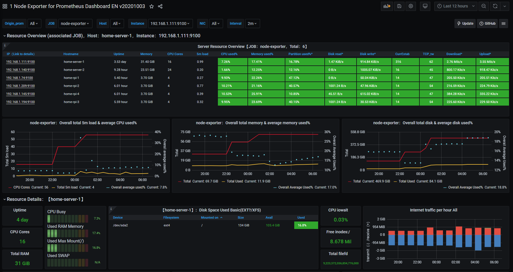
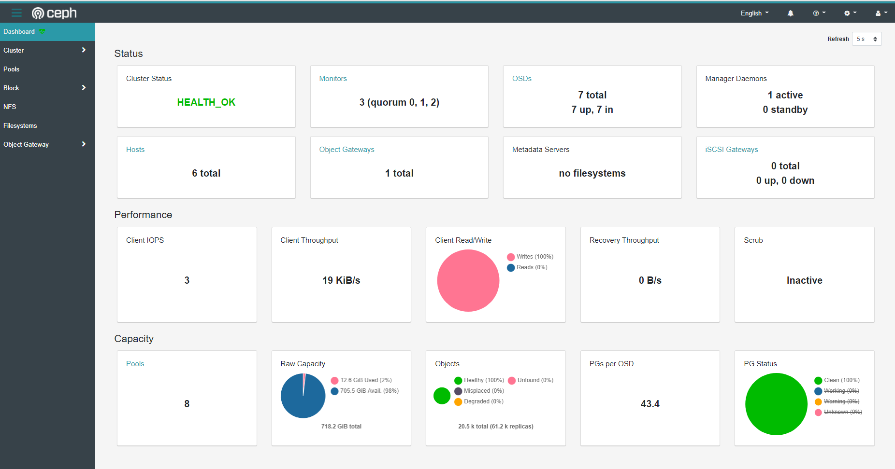

```
kubectl get nodes -o wide
NAME            STATUS   ROLES    AGE     VERSION   INTERNAL-IP     EXTERNAL-IP   OS-IMAGE             KERNEL-VERSION     CONTAINER-RUNTIME
home-rpi-1      Ready    <none>   6h22m   v1.19.2   192.168.1.74    <none>        Ubuntu 20.04.1 LTS   5.4.0-1019-raspi   containerd://1.3.3-0ubuntu2
home-rpi-2      Ready    <none>   6h22m   v1.19.2   192.168.1.209   <none>        Ubuntu 20.04.1 LTS   5.4.0-1019-raspi   containerd://1.3.3-0ubuntu2
home-rpi-3      Ready    <none>   6h17m   v1.19.2   192.168.1.194   <none>        Ubuntu 20.04.1 LTS   5.4.0-1019-raspi   containerd://1.3.3-0ubuntu2
home-rpi-4      Ready    <none>   6h11m   v1.19.2   192.168.1.145   <none>        Ubuntu 20.04.1 LTS   5.4.0-1019-raspi   containerd://1.3.3-0ubuntu2
home-server-1   Ready    master   3d12h   v1.19.2   192.168.1.111   <none>        Ubuntu 20.04.1 LTS   5.4.0-48-generic   cri-o://1.19.0
home-server-2   Ready    <none>   9h      v1.19.2   192.168.1.140   <none>        Ubuntu 20.04.1 LTS   5.4.0-48-generic   cri-o://1.19.0
```

Homelabs are cool. Happy I made one too. Let's me test things against non-prod clusters like yolo rook configurations and advanced networking with multus. Though this is about building one for now.

A few things are used to make this all work.

Thing | Resource | Prerequisites
-|-|-
Baremetal Servers | You can get these many places | OS Installed
Deployer | [kubeadm](https://kubernetes.io/docs/setup/production-environment/tools/kubeadm/install-kubeadm/#installing-kubeadm-kubelet-and-kubectl) | Instructions followed based on your distro
Container Runtime Interface (CNI) | [Containerd](https://containerd.io/downloads/) or [CRI-O](https://cri-o.io/#distribution-packaging) recommended | Same as above
Container Network Interface (CRI) | [Kube Router](https://www.kube-router.io/) | All devices on same network
Storage | [Rook Ceph](https://rook.io/docs/rook/v1.4/ceph-storage.html) | Raw Devices w/ No Partitions [More Info](https://rook.io/docs/rook/v1.4/ceph-prerequisites.html)
Load Balancing | [Metallb](https://metallb.universe.tf/usage/) | Layer 2 more w/ a range of IPs reserved for Load Balancer service type
Monitoring | [Prometheus Operator](https://github.com/prometheus-community/helm-charts) | Above installed
Git Ops | [FluxCD](https://docs.fluxcd.io/en/1.21.0/tutorials/get-started-helm/) | A git repo accessible by cluster

Following the docs in the above repo make for a great home cluster. You can even go as far as to run Virtual Machines using [kubevirt](http://kubevirt.io/) once you have it all running. Now, this isn't really a step-by-step how-to guide. More of a reference. Though you are free to get started with a quick [gist](https://gist.github.com/sfxworks/d41f9878248ee66ab99df540c8c64366) for Ubuntu 20 (likely for all DEB based systems, though untested) to prep your nodes and [my git-ops repo](https://github.com/sfxworks/home-cluster) that includes the above. You'll need to fork it though and apply your own configurations based on your needs. I hope this serves as a starting point for your adventures! 



