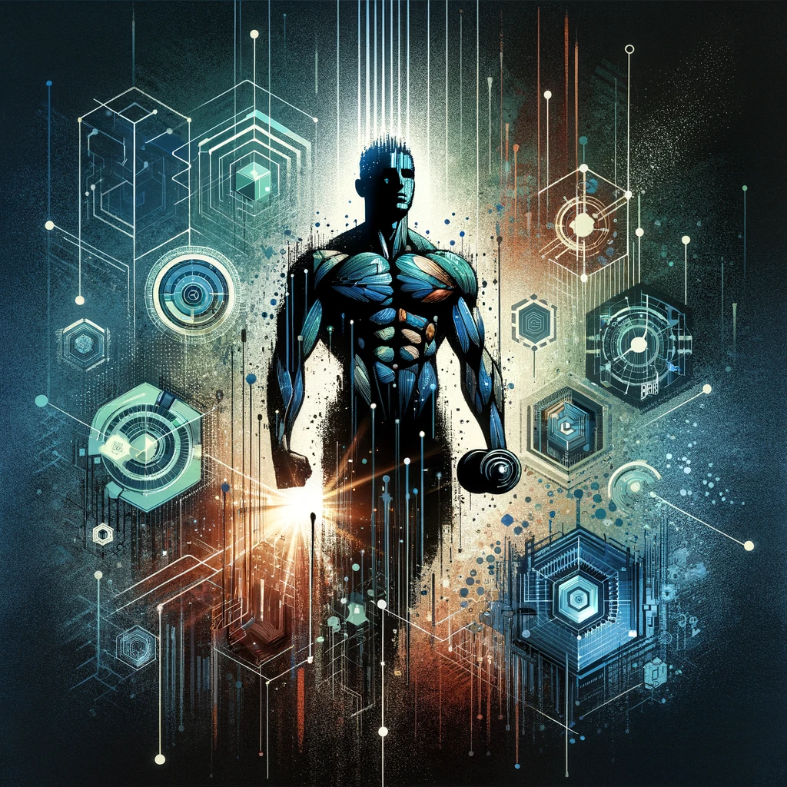

**Psychological Well-Being**

It's a very important thing, so I wish to emphasize it for a bit.

Aside from my amazing projects, I've encountered some hurdles in my life recently. While I won't go into detail here, as I don't want this to turn into a vent post, I just want to say:

It's, as I am learning, important to take care of yourself. I appreciate the friends I have, some of whom are like family to me. Work has thankfully provided me with the resources to recover, and my employees have been holding the fort very well during this time. The key takeaways, though, are these:

- Empathy is cool. Enabling someone who puts you down is not. "Lethal loyalty" is a term my therapist taught me, and it's not something you should ever practice.
- Remember your friends and your surroundings. Try sharing with those you trust, a support group. If you've shared with people who left, talk yourself through it for a while until you feel comfortable opening up to someone new.
- Go outside. Go to the gym. Ride a bike. Breathe. The environment around you has an impact.
- Remember how far you've come. Don't even think about ending it there. Overwhelming thoughts can be challenging, but know that you can fight them.
- Being strong doesn't mean pretending to be okay while you suffer inside. That's just self-harm. It's about being strong enough to accept times when you're not at your best and pushing through them. Enjoy the pride you feel after winning another battle. We are amazing creatures, but we are not gods.
- People who don't have your best interests at heart may label you or say things that make things worse. Don't let them get to you, and stay away from them if it starts to affect you significantly.
- There's nothing wrong with being real.
