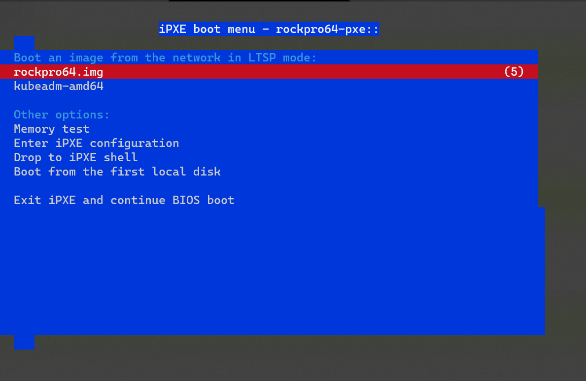
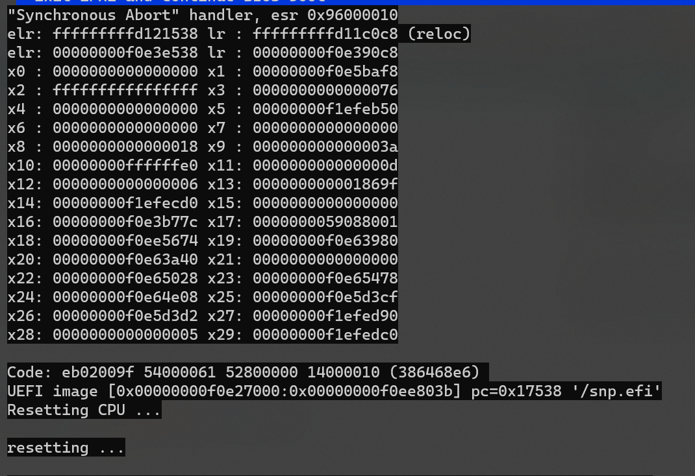

# PXE using UBOOT with RockPro64 

[](https://asciinema.org/a/1CfOJO81IaeLnyjmT3l2RGdVW)


The RockPro64 is a clever little device with 4GB of RAM and a PCIe gen1x4 lane. I've discovered the most exciting thing is its SPI (Serial Peripheral Interface). The equivalent of a BIOS on traditional motherboards for interacting with the bootloader. The ARM community, including the RockPro64, uses u-boot.

U-Boot, or "DAS U BOOT" as the pun goes, is a universal boot loader. You can build one and run it from the SPI to then load your actual OS from other supported sources. Like an NVMe.

## Flashing u-boot

Sigmaris has done a great job of maintaining a fork for the RockPro64. His [latest release](https://github.com/sigmaris/u-boot/releases/tag/v2021.04-rockpro64-ci) is what you will need to flash the bootloader. 

The easiest way to do this,

1. Take a copy of [any compatible OS](https://wiki.pine64.org/wiki/ROCKPro64_Software_Release) and boot into it as normal
2. Download the [spi_combined.img](https://github.com/sigmaris/u-boot/releases/download/v2021.04-rockpro64-ci/spi_combined.img) after boot
3. Use `flashcp` to flash your firmware.

On manjaro, it's exposed as /dev/mtd0
As an example:
```
[root@manj-sd spi_u-boot]# flashcp -v -A spi_combined.img /dev/mtd0
Erasing blocks: 4096/4096 (100%)
Writing data: 1448k/1448k (100%)
Verifying data: 1448k/1448k (100%)
```

Feel free to, at this point, take any OS that wouldn't normally have u-boot embedded such as the [Fedora CoreOS image](https://builds.coreos.fedoraproject.org/prod/streams/stable/builds/35.20220116.3.0/aarch64/fedora-coreos-35.20220116.3.0-live.aarch64.iso), flash it to anything (a USB, NVMe, another sd card etc) and plug it into boot.

You're in, just like the video at the top!

Though let's try PXE now.

## PXE Booting

The RockPro64 will fetch the default config as well as the following in this order,

```
Retrieving file: pxelinux.cfg/01-e6-41-ab-b7-a6-86
Retrieving file: pxelinux.cfg/C0A8009C
Retrieving file: pxelinux.cfg/C0A8009
Retrieving file: pxelinux.cfg/C0A800
Retrieving file: pxelinux.cfg/C0A80
Retrieving file: pxelinux.cfg/C0A8
Retrieving file: pxelinux.cfg/C0A
Retrieving file: pxelinux.cfg/C0
Retrieving file: pxelinux.cfg/C
Retrieving file: pxelinux.cfg/default-arm-rk3399-rockpro64_rk3399
Retrieving file: pxelinux.cfg/default-arm-rk3399
Retrieving file: pxelinux.cfg/default-arm
Retrieving file: pxelinux.cfg/default
```

So, it will first try the mac address, then the Hexadecimal values of the IP address (That example is the hex value of 192.168.0.156). It truncates one char each time during that phase. Then finally tries default arm paths based on the processor and board name. 
Plop in a generic PXE config to your desired file, and you're ready to go. 

Here's an example from gamiee, one of the staff in the Pine64 community:
```
timeout 10
menu title Select kernel

label gamiee-570
    kernel /srv/kern570/Image
    initrd /srv/kern570/initrd.img
    devicetreedir /srv/kern570/dts/
    append rw panic=10 init=/sbin/init coherent_pool=1M ethaddr=\${ethaddr} eth1addr=\${eth1addr} serial=\${serial#} cgroup_enable=cpuset cgroup_memory=1 cgroup_enable=memory swapaccount=1 root=/dev/nfs nfsroot=\${serverip}:/storage/pxe/node5 rootwait rootfstype=ext4
```

Something to note is that the device tree can also be specified in the PXE config. The device tree is responsible for ensuring whatever OS boots can properly talk to the hardware on the rockpro64. You can also adjust the DTB to do overclocking, but I'll go over that later.

### A few things to note

As [their doc](https://github.com/u-boot/u-boot/blob/master/doc/README.pxe) says, it's a subset of the functionality. Now, generic configs will work just fine and standard deployments, but if you wish to work with a proxy DHCP server or specify more than one initramfs, you'll want to note the following.


## PXE with Proxy DHCP 
This is easy, though you'll need a serial to USB reader. [This forum post](https://forum.pine64.org/showthread.php?tid=6387) goes over it well. In a nutshell,

1. Plug in a USB to serial reader (ensuring it's set to 3v3 with a jumper or built-in) to pins 6 (ground) 8 (TX), and 10 (RX).
2. Run `screen /dev/ttyUSB0 1500000` or whichever serial device you wish to access
3. Start the RockPro64

Great you have serial access. Unfortunately, there's a bit of a glitch in that it will not set the server IP when it first starts. I've even tried testing this with upstream merges and others in the pine64 community. Assuming your PXE server is up and running, running `pxe boot` will get you booted over the network. To make this permanent every time, first run `setenv serverip 1.1.1.1` and then `saveenv`. Replace 1.1.1.1 with your TFTP address of course.

You're now booting over the network! (The live image is something I'm still having issues with when using Fedora CoreOS).

## PXE with more than one initramfs

Even if you separate the initrd images in the PXE configuration file with commas, it will ignore the others. So you have to merge them.

Let's say, for example, you're running [LTSP](https://ltsp.org/) and want do to a pxe setup.

First, make a pxe config if you're using LTSP since that tool only generates iPXE
```
menu title Linux selections

default rockpro64
timeout 40

label rockpro64
   menu label rockpro64
   fdt /dtb/rockchip/rk3399-rockpro64.dtb
   append root=/dev/nfs nfsroot=1.1.1.1:/srv/ltsp ltsp.image=images/rockpro64.img loop.max_part=9
   initrd /ltsp/combined.img.gz
   kernel /ltsp/rockpro64/vmlinuz
```

Replacing 1.1.1.1 again of course.

Combine your `initrd.img` and others. In this example ill combine my `/srv/tftp/ltsp/rockpro64/initrd.img` and `/srv/tftp/ltsp/ltsp.img`.

Compress or ensure all images are in the gz format. Example running `file` against one shows,
```
/srv/tftp/ltsp/rockpro64/initrd.img: gzip compressed data, from Unix, original size modulo 2^32 45087744
```

Though the ltsp.img is not. So Running `gzip` against the `ltsp.img` prepares my image.

Then merge them using `ltsp.img.gz your-initrd.img.gz > combined.img.gz`.

Place it in yout TFTP directory and you're all set! 

## What's next?



Well, I've been trying to get iPXE working using [this guide](https://u-boot.readthedocs.io/en/v2021.04/uefi/iscsi.html) with LTSP. Though that doesn't seem to be working just yet. I may have loaded it into the wrong memory address or other issues may be occuring behind the scenes.



There's also the issue of having to set the server IP first in the case scenario of proxy DHCP setups. A full log with LTSP in this mode can be found [here](https://pastebin.com/BqSb87BS) without it. It boots, but only with the `pxe boot` command as I described above. Even with upstream merges tested using [this PR](https://github.com/sigmaris/u-boot/pull/7) it still doesn't seem to want to work. Though stay tuned for updates there.

I also want to save light images to the SPI, at least everything except the rootfs. This could mock the [beta bootloader](https://www.raspberrypi.com/news/network-install-beta-test-your-help-required/) for the Raspberry PI that just came out which allows installing of an OS over the network. A great solution to the chicken and the egg problem. Though in this case I'd just throw fedora coreos on there and specify an ignition on boot. Or maybe Arch's [network boot mode](https://wiki.archlinux.org/title/Netboot)? 

### And a big thanks!
Thank you, dsimic, gamiee, sigmaris and the Pine64 community, as well as alkisg from the LTSP community for getting me through these battles during those long nights of troubleshooting with energy drinks everywhere. 


